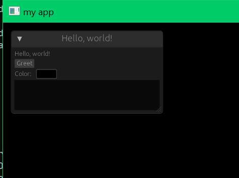

# egui_sdl2_canvas

This is [egui](https://github.com/emilk/egui) over the [canvas](https://docs.rs/sdl2/latest/sdl2/render/struct.Canvas.html) object from the sdl2 crate (better known as [SDL_Renderer](https://wiki.libsdl.org/SDL2/CategoryRender) in C).

Work in progress, feedback / proposals appreciated! 

The examples folder shows two little applications, using egui_sdl2_platform and my backend. (egui_sdl2_platform is currently limited to egui 0.27, but I made a PR)

